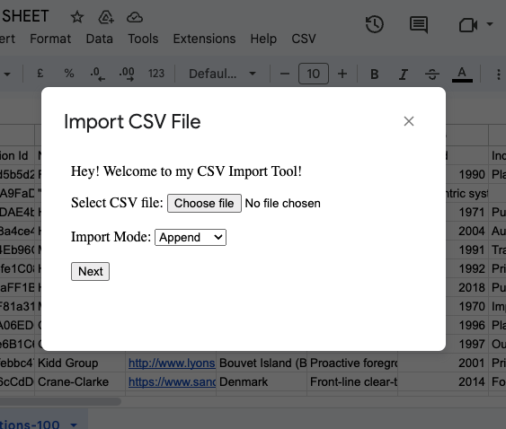
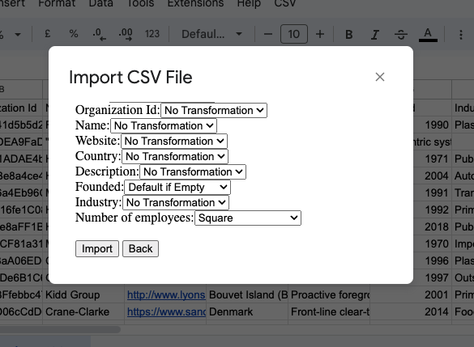

# Backend Engineer | StackIt Assignment
**Anirudh Mishra**

[anirudh04mishra@gmail.com](mailto:anirudh04mishra@gmail.com)

**Problem Statement**: https://comfortable-kicker-92c.notion.site/Backend-Engineer-StackIt-Assignment-ebcf93511ed9420c8c245b9df446f5b7

**Sheet: (with script attached)** https://docs.google.com/spreadsheets/d/10UQme7WBkNQGs6E8ZBYBK2k2HePRf0wWA9zhSKMDvWM/edit?usp=sharing
I have added abhinav@nowstackit.com to the list of testing users for the script, so you should be able to access it (via the "CSV" menu in the toolbar, once it fully loads)

## Implementing quickly using Google Apps Script
Why build a full app/extension using a frontend backend framework if you can leverage the existing functionality of Google Apps Script (meant for light-weight scripting for workspace apps)?

**Note:** It is possible to import a CSV and set it to append in the current sheet via Files > Import. So the main thing to implement with this script will be the data-transformation while importing the csv.

I implemented it using a container bound google app script in Sheets:

Here I have a set of predefined transformations that the user can choose from such as date transformation, squaring every number, allotting default value to each empty field.
